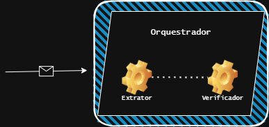

# Email Data Extraction Agent

This project automates the extraction of financial information from email content. It uses a structure with three main parts: a data extractor, a verifier, and a class that orchestrates the entire process.

> **Why use agents for unstructured emails?**  
> - **Robust to variation:** LLM-based agents understand natural language, noise, forwards, and inconsistent formatting without relying on brittle regex rules.  
> - **Reliable extraction:** layered prompts + a strict output schema ensure consistent JSON even when some fields are missing.  
> - **Lower maintenance:** instead of crafting rules for each client/template, add examples and adjust prompts.  
> - **Scalable & multilingual:** one pipeline handles multiple formats, financial terms, and languages.  
> - **Governance:** separating **Extractor / Verifier / Orchestrator** improves auditability, applies validations, business rules, and fallbacks.  
> - **Security:** anti–prompt-injection instructions, numeric normalization, and type coercion reduce errors and manipulations.


## How it works

1. **Receiving the email**  
   The system receives the body of an email containing information such as the asset name, unit price, and quantity purchased.

2. **Data extraction (ExtractorAgent)**  
   A language model (TinyLlama) analyzes the email text and attempts to extract the key information in JSON format.  
   Example:
   ```json
   {
     "Nome": "PETR4",
     "Preco": 32.50,
     "Qtd": 100
   }
   ```

3. **Data validation (VerifierAgent)**  
   The JSON generated by the extractor is validated:
   - Fixes small formatting issues (e.g., commas instead of dots).
   - Ensures the values make sense (e.g., quantity must be greater than zero).
   - When possible, compares extracted values with the total transaction value (e.g., "FIN") in the email.

4. **Orchestration (Orchestrator)**  
   The `Orchestrator` class coordinates the whole process:  
   - Sends the email text to the extractor.  
   - Passes the output to the verifier.  
   - Activates the fallback if necessary.  
   - Returns a final, clean and reliable result.




## Example usage

```python
email = """
COMPRA:NTN-B 15/08/2026
QTDE: 320.000
PU: 4.374,14
FIN: R$ 999.999,45
"""

orchestrator = Orchestrator(ExtractorAgent(), VerifierAgent())
result = orchestrator.run(email)

print(result)
```

## Why use AI to parse unstructured financial emails?

Traditional rule-based parsers rely on strict patterns and consistent formats (e.g., `"QTD: 100"`, `"PU: 32.50"`).  
But in the real world — especially when emails are written manually by humans — the formatting is often inconsistent or contains small errors.

### The problem with hard-coded parsers

If we try to extract data using only code-based patterns or regular expressions, the system becomes fragile and prone to breaking with small changes, such as:

- Using commas instead of periods:
  - `PU: 235,45` instead of `PU: 235.45`
- Irregular spacing:
  - `COMPRA : PETR4`
- Inconsistent labels:
  - `Qtd`, `qtde`, `quantity`, `QTD.`
- Missing symbols:
  - `Preco 99999` instead of `Price: R$ 99,999.00`
- Changed order:
  - Asset name at the end or middle of the text

These small variations are common and make **traditional parsers brittle and hard to maintain**.

### How AI helps

By using a language model like **TinyLlama**, we teach the AI to understand the **intent and meaning** of the message — even if it’s poorly formatted or written in a more casual way. This allows:

- More tolerance to human error
- More flexible and accurate data extraction
- Easier adaptation to new email formats
- Independence from strict pattern-matching logic

### Example

Given this email:

```
Hello team, today’s trade was completed.
We bought 300 units of the XPML11 fund for R$ 115,40 each.
Best regards.
```

Even though it lacks the usual patterns like `QTD:` or `PU:`, the AI can still understand the message and return:

```json
{
  "Nome": "XPML11",
  "Preco": 115.40,
  "Qtd": 300
}
```

A rule-based parser would likely fail in this situation.

---

With this approach, the system becomes more robust, intelligent, and scalable, even when dealing with messy, human-written content every day.
