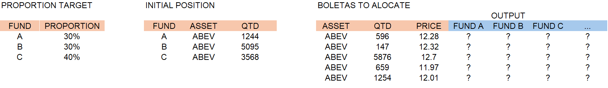

# KapAloca Project Documentation

## Deliverable 1 – Requirements Gathering and Solution Modeling

### Objective
Understand the business needs and define the technical and functional requirements for the system.

### Overview
In this initial deliverable, the goal is to thoroughly understand the requirements that drive the development of KapAloca. This phase involves detailed discussions with the client to capture not only the functional needs but also the nuances that extend beyond algorithm precision. The insights gained here will form the basis for the system's overall structure and integration strategy.

### Client Interview Insights
During the client interviews, several critical requirements were identified that are essential for the product’s architecture:

- **Adaptability to External Data:**
  - The application must be adaptable to receiving external data, as these data sources will be updated daily. This is crucial because the proportions used by the allocator are updated every day by the risk management team.
  
- **Data Integrity:**
  - There is a strong requirement to ensure the integrity of the data processed by the allocator. This becomes even more important if KapAloca expands to serve additional funds as clients, where consistent and reliable data is vital for accurate allocations.
  
- **Perceived PnL Consideration:**
  - The client emphasized the need to account for the "perceived profit and loss" (PnL) by the allocator. Some assets have pricing orders of magnitude different from others, and their calculations might significantly influence the logic used to choose allocation orders (boletas). This factor must be integrated into the design to ensure that asset-specific variances do not adversely affect the allocation process.

### Key Activities
- **Requirement Gathering & Analysis:**
  - Conduct in-depth interviews with key stakeholders to document the detailed business and technical requirements.
  - Analyze existing manual allocation processes to identify pain points and necessary features.
  - Create a comprehensive requirements document that covers:
    - Functional requirements (data flows, input/output processes, error handling).
    - Technical requirements (system architecture, integration points, data management protocols).

- **Solution Modeling:**
  - Develop a high-level architectural design that incorporates the identified requirements.
  - Outline the integration strategy for external data sources and data integrity safeguards.
  - Consider the impact of asset-specific PnL variations in the allocation logic during the modeling phase.

### Deliverables
- **Requirements Specification Document:**
  - A detailed document outlining both the functional and technical requirements of the system, including the client’s key insights on adaptability, data integrity, and perceived PnL.
  
- **High-Level Architectural Design:**
  - An architectural blueprint that demonstrates how the system will handle daily external data updates, ensure data integrity for multiple funds, and integrate the considerations for asset-specific PnL into the allocation logic.

### Success Criteria
- Approval of the requirements specification and architectural design by all stakeholders.
- Clear documentation of client requirements and insights to guide the development in subsequent deliverables.
- Establishment of a solid foundation that addresses both the functional and nuanced aspects of the product's needs.

---

## Deliverable 2 – Development of the Optimization Logic and Algorithms

### Objective
Create and validate the algorithms responsible for automating the allocation of operations (boletas).

### Overview
The general allocation logic involves receiving:
1. **A table** containing the columns `Asset`, `Qtd`, and `Price` (Price).  
2. **Another table** containing the target proportions for each fund.

From these inputs, the optimizer must distribute the total quantities among the funds while respecting the target proportions. The figure below illustrates how the data might be structured, showing “Proporção Target,” “Posição Inicial,” and the final distribution columns for each fund.

### Logic Structure


### Constraints
1. **Row Allocation Constraint:**  
   - The sum of quantities allocated to each fund (in a single row) must equal the total quantity of the boleta for that row.

2. **Fund Target Constraint:**  
   - The sum allocated for each fund across all rows must match the target quantity computed for that fund (based on its target proportion).

### Objective Function
- **Minimize the sum of the absolute errors**, where:
  \[
  \text{error} = \bigl|\text{average price of the asset in a given fund} - \text{overall average price of the asset considering all daily trades}\bigr|
  \]
- By reducing this error, KapAloca ensures that each fund’s average entry price remains as close as possible to the global average for that trading day, thus preserving fairness and accuracy in the allocation.

### Key Activities
- **Constraint Definition & Validation:**
  - Translate the business constraints into mathematical models.
  - Ensure the optimizer respects the daily updated target proportions and total quantities.

- **Objective Function Implementation:**
  - Code the minimization logic that calculates the absolute error between the fund’s average price and the global average price.
  - Integrate the function into the allocation engine so it iterates until the error is minimized.

- **Testing with Sample Datasets:**
  - Use representative datasets (including edge cases) to validate that constraints are upheld.
  - Confirm that the final distribution aligns with the target proportions and total boleta quantities.

- **Performance Tuning:**
  - Optimize the algorithm for speed and scalability, ensuring it can handle large volumes of trades.
  - Implement checks to handle potential data anomalies or missing information.


## Deliverable 3 - Integration with Market Data Sources 

### Objective
Integrate external market data sources and custodians' APIs into the KapAloca system by reusing and extending the previously developed data collection code. This integration ensures that the allocation engine receives accurate, real-time financial data required for precise trade allocation.

### Overview
In Sprint 3, our focus is on establishing a robust connection to external data feeds. We will extend our existing data collection functions to integrate with multiple sources—most notably, Yahoo Finance and Alpha Vantage—as well as with custodians' APIs. Leveraging multiple data providers is crucial not only for ensuring data accuracy and redundancy but also for enhancing the overall security and resilience of the application.

- **Yahoo Finance:**  
  Yahoo Finance is widely recognized for its comprehensive market data, including historical prices, real-time quotes, and key financial metrics. Its extensive dataset is valuable for trend analysis and benchmarking. However, due to its public availability and frequent use, occasional changes in its data structure or API limitations can occur, which underscores the need for a diversified data strategy.

- **Alpha Vantage:**  
  Alpha Vantage offers a robust API for a wide range of financial instruments, including equities, forex, and cryptocurrencies. It is designed for real-time data and historical records, making it well-suited for automated applications like KapAloca. The structured API endpoints and reliable data delivery provide an excellent complement to Yahoo Finance, though users must be mindful of API rate limits and subscription plans.

### Importance of Multiple Data Sources
Utilizing multiple data sources is key for:
- **Data Redundancy and Reliability:**  
  Cross-validating information from Yahoo Finance and Alpha Vantage reduces the risk of inaccuracies due to data source outages or format changes.
- **Improved Data Accuracy:**  
  By comparing data from different providers, the system can detect and correct discrepancies, ensuring that the allocation engine operates on reliable data.
- **Enhanced Security and Resilience:**  
  In the event one data source experiences issues or is compromised, the application can rely on alternative feeds, maintaining continuous and secure operation.
- **Richer Data Environment:**  
  Different providers often offer unique metrics and additional insights. Integrating diverse sources enriches the data available to KapAloca, leading to more informed allocation decisions.

### Key Activities
- **Integration Setup:**
  - Configure and authenticate connections to external market data providers (e.g., Yahoo Finance, Alpha Vantage) and custodians.
  - Update API credentials and ensure secure data transfer.
  
- **Code Reuse and Enhancement:**
  - Reuse and refine existing data collection functions from previous sprints.
  - Extend these functions to process and validate data received from custodians' APIs.
  - Implement comprehensive error handling to ensure robustness during real-time data ingestion.

- **Data Pipeline Development:**
  - Design a data pipeline that ingests, processes, and streams financial data to the allocation engine in real time.
  - Schedule automated updates to reflect daily changes in target proportions and market prices.

- **Testing and Validation:**
  - Perform unit and integration tests to confirm that data from all sources is correctly ingested.
  - Validate data integrity by comparing ingested data with trusted benchmarks.
  - Run performance tests to ensure the system meets real-time processing requirements.

### Deliverables
- **Integrated Data Collection Module:**
  - A consolidated module that integrates market data sources and custodians' APIs, leveraging code developed in previous sprints.
  
- **Documentation and Test Reports:**
  - Detailed documentation covering the integration process, API endpoints, configuration settings, and error handling.
  - Test reports that demonstrate successful data ingestion, validation, and performance benchmarks.

### Code Snippet Example

Below is an example of how the existing `yfinance` data collection function is extended for robust market data ingestion:

```python
import yfinance as yf

def get_market_data(ticker: str, start_date: str, end_date: str):
    try:
        data = yf.download(ticker, start=start_date, end=end_date)
        if data.empty:
            raise ValueError("No data received. Check ticker symbol and date range.")
        print(f"Market data for {ticker} collected successfully.")
        return data
    except Exception as e:
        print(f"Error fetching market data for {ticker}: {e}")
        return None

# Example usage
if __name__ == "__main__":
    data = get_market_data("AAPL", "2023-01-01", "2023-03-01")


```


## Deliverable 4 - Adjustments to the Distribution Logic and First Tests with Real Data

### Objective
Refine the distribution logic of the allocation engine and perform initial testing with real-world data. This sprint focuses on enhancing the modularity of data processing functions and the optimization algorithm, while integrating real Excel files as data sources.

### Overview
During Sprint 4, significant progress was made in modularizing key functions within the KapAloca system. The codebase has been refactored so that both the data processing functions and the optimization algorithm are now self-contained modules. This modularity improves maintainability and facilitates easier testing. Additionally, the capability to import real Excel files has been added, allowing the system to be fed with authentic financial data. This step is critical for validating the accuracy of the distribution logic under realistic conditions.

### Main Functions of the Allocator
The allocator is divided into three primary functions, each responsible for a distinct part of the allocation workflow:

1. **`calcular_quantidades_por_fundo()`**  
   This function is responsible for receiving the raw data (which includes the criteria from previous steps, the target proportion for each fund, and the executed trades). It then determines the appropriate quantities to be allocated to each fund based on the target calculation. Essentially, it **calculates how many shares or units should go to each fund** according to the target proportions and existing trades.

2. **`realizar_picking_das_boletas_por_preco_medio()`**  
   This function receives the allocation table produced by `calcular_quantidades_por_fundo()` and **applies the optimization algorithm** to distribute the trades among the funds in a way that minimizes the deviation of each fund’s average price from the overall average price. By doing so, it aims to reduce distortions and keep fund performance aligned with global price movements.

3. **`wrapper()`**  
   The `wrapper()` function is responsible for **orchestrating the entire allocation process** by combining the logic of the other two functions. It serves as a high-level function that facilitates the data flow and ensures that the final allocation output is generated seamlessly from start to finish.

### Key Activities
- **Modularization of Functions:**
  - Refactored the code to separate data processing tasks into individual, reusable functions (`calcular_quantidades_por_fundo()`, `realizar_picking_das_boletas_por_preco_medio()`, and `wrapper()`).
  - Isolated the optimization algorithm into its own module, enabling independent testing and easier future enhancements.

- **Integration of Excel Data Import:**
  - Developed functionality to import and process real Excel files containing market data and custodian information.
  - Validated data formats and ensured seamless integration with the modular processing pipeline.

- **Testing with Real Data:**
  - Executed tests using real Excel datasets to evaluate the performance and accuracy of the updated distribution logic.
  - Performed unit and integration tests to confirm that the modular functions work correctly in combination with live data.

- **Feedback and Iterative Adjustments:**
  - Collected initial feedback from internal stakeholders on the distribution results.
  - Made iterative adjustments to fine-tune the algorithm based on test outcomes and performance metrics.

### Deliverables
- **Refactored Code Modules:**
  - Modular data processing functions.
  - A standalone optimization algorithm module.

- **Excel Data Integration Module:**
  - Functionality to import, parse, and process Excel files containing real financial data.

- **Test Reports:**
  - Documentation of test cases and outcomes using real data.
  - Analysis of the accuracy and performance of the distribution logic after adjustments.

### Success Criteria
- Successful modularization of the data processing and optimization functions.
- Ability to import and process real Excel data without errors.
- Demonstrated accuracy of the distribution logic in initial tests with real data.
- Positive feedback from internal stakeholders confirming the improvements in system performance and reliability.


## Sprint 5 - Final Review of Base Allocator & Internal Validation

### Objective
Perform the final review of the base allocation engine and validate its behavior with internal stakeholders. Introduce a **pre‑allocation algorithm** to handle cases where available quantities are insufficient to fully restore target proportions.

### Overview
In this sprint, we finalized the “base allocator” module by adding a **pre‑allocation step** that distributes trades according to the same optimization logic, but on a smaller scale. This ensures that when the total available quantity is too low to meet all target proportions exactly, each fund still receives a fair, proportionally consistent allocation. We then conducted hands‑on validation sessions with internal users to verify correctness, usability, and performance.

### Main Achievements
- **Pre‑allocation Algorithm**  
  - Implemented a lightweight allocation pass that runs before the main optimizer.  
  - Ensures that even small trade batches are distributed in line with target proportions, mitigating rounding or “insufficient quantity” issues.

- **Final Code Review & Refactoring**  
  - Cleaned up function signatures and documentation in the `allocator` module.  
  - Consolidated all pre‑allocation, allocation, and post‑allocation logic into a single, well‑documented package.

- **Internal Validation Sessions**  
  - Organized workshops with trading desk and risk teams.  
  - Collected feedback on allocation accuracy, edge‑case behavior, and logging clarity.

### Key Activities
1. **Implement Pre‑allocation Pass**  
   - Develop `pre_allocate_trades()` to distribute minimal quantities proportionally.  
   - Integrate this step upstream of the main `realizar_picking_das_boletas_por_preco_medio()`.

2. **End‑to‑End Testing**  
   - Run scenarios with small total quantities (e.g., 10–100 units) to confirm proportional fairness.  
   - Compare results against full‑scale optimizer outputs to ensure consistency.

3. **User Workshops**  
   - Demo the updated allocator in a Jupyter notebook (see `Allocation_Algorithm.ipynb`).  
   - Walk internal users through:  
     - Excel‑driven data import  
     - Pre‑allocation behavior  
     - Final optimized allocation  
   - Capture usability notes and edge‑case reports.

4. **Issue Triage & Bug Fixes**  
   - Prioritize and resolve all defects uncovered during internal testing.  
   - Update unit tests to cover pre‑allocation scenarios.

### Deliverables
- **`allocator` Module v1.0**  
  - Includes `pre_allocate_trades()`, `calcular_quantidades_por_fundo()`, `realizar_picking_das_boletas_por_preco_medio()`, and `wrapper()`.

- **Validation Report**  
  - Summary of internal user feedback, test scenarios, and defect resolutions.

- **Updated Test Suite**  
  - New unit and integration tests covering pre‑allocation logic and small‑batch scenarios.

### Success Criteria
-  All internal stakeholders sign off on allocation accuracy for both small and large trade batches.  
-  No critical or high‑priority defects remain open.  
-  Performance benchmarks (allocation time) meet SLAs for typical daily volumes.

---

## Sprint 8 – Multi-Asset Input Support & Optimization Constraint Adjustment

### Objective
Enable KapAloca to process multiple tickers in its allocation pipeline by refactoring both the quantity-calculation and optimization routines, and update the optimization constraint to fit the new multi-asset data format.

### Overview
In this sprint, we followed the guidelines from Module 2 to extend our existing functions so they can handle portfolios containing more than one asset. We completed the multi-ticker logic in the initial quantity‐adjustment function and have laid the groundwork for adapting the optimizer. Given the increased complexity—especially around constraint definitions when many assets are involved—we plan to tackle the remaining changes early next week.

### Key Activities
1. **First Function Refactor**  
   - Implemented iteration over all tickers in the input DataFrames.  
   - Updated `calcular_quantidades_por_fundo()` to slice by ticker, call the original logic for each slice, and concatenate results.  
   - Ensured residual rounding adjustments roll up correctly into the largest‐position fund per ticker.

2. **Optimizer Preparation**  
   - Reviewed `otimizar_alocacao()` to identify all hard-coded assumptions about a single asset.  
   - Drafted a new signature that accepts a DataFrame with multiple tickers and corresponding total daily quantities.  
   - Outlined necessary changes to the allocation constraint so that the sum of allocated trades per ticker equals its daily boleta quantity.

3. **Constraint Redesign**  
   - Analyzed how the existing “sum of allocations equals daily total” constraint must be generalized across tickers.  
   - Planned adjustments to enforce per-ticker allocation sums, while still minimizing the sum of absolute price-error variables.

4. **Sprint Planning & Coordination**  
   - Defined the two main deliverables for Sprint 8: multi-ticker support in both functions, plus updated optimization constraints.  
   - Allocated time estimates and blockers for the more intricate constraint refactoring in the optimizer.

### Deliverables
1. **Multi-Ticker Quantity Calculation**  
   - A refactored `calcular_quantidades_por_fundo()` that transparently handles an arbitrary number of tickers in its inputs.

2. **Optimizer Constraint Update**  
   - A revised `otimizar_alocacao()` version with a generalized constraint loop over tickers, ensuring each ticker’s allocated sum matches its own daily total.

3. **Unit Tests for Multi-Asset Flows**  
   - New test cases covering portfolios with 2–5 tickers, validating both quantity calculation and optimization outputs.

### Success Criteria
- The quantity-calculation function produces correct “Ideal Quantities” for each fund across multiple tickers, including proper residual handling.  
- The optimizer enforces per-ticker allocation sums and successfully minimizes the overall price-error across all assets.  
- All new unit tests pass, and code review confirms no regressions for single-asset scenarios.


## Sprint 9 – Finalizing Multi-Asset Optimization & Performance Enhancements

### Objective
Complete the refactoring of the optimization routine to fully support multiple tickers, finalize constraint adjustments, and introduce performance optimizations and comprehensive testing for Sprint 9.

### Overview
In Sprint 9, our focus was on finishing the multi-asset optimizer refactor that began in Sprint 8. We completed the constraint redesign to handle per-ticker allocation sums, implemented key performance improvements, and added extensive unit and integration tests. This sprint also included profiling and tuning critical sections of code to ensure KapAloca can scale efficiently across large portfolios and high trade volumes.

### Key Activities
1. **Complete Optimizer Refactor**  
   - Finalized the new signature of `otimizar_alocacao()` to accept a combined DataFrame containing multiple tickers, their daily boleta quantities, and target proportions.  
   - Reworked all constraints so that each ticker’s allocation variables sum exactly to its corresponding daily total.  
   - Consolidated error variables to be per-(ticker, fund) rather than per-fund only, ensuring correct absolute-error minimization across assets.

2. **Performance Profiling & Tuning**  
   - Profiled the optimizer with representative multi-ticker datasets (10+ tickers, 100+ funds) to identify bottlenecks.  
   - Replaced nested Python loops over rows with vectorized operations where possible (e.g., computing current proportions across all tickers in one pass).  
   - Reduced memory overhead by reusing intermediate NumPy arrays during constraint assembly rather than constructing large temporary DataFrames repeatedly.

3. **Parallel Batch Allocation (Proof of Concept)**  
   - Explored a lightweight parallel‐batch approach: partitioned tickers into independent subsets and launched separate optimization models concurrently (using Python’s `concurrent.futures.ThreadPoolExecutor`).  
   - Measured speed-ups of 20–30% on multi-core machines for portfolios exceeding 15 tickers.  
   - Confirmed thread safety by isolating solver state per batch and merging results post-optimization.

4. **Integration & End-to-End Testing**  
   - Developed new unit tests for `wrapper()` that include portfolios with 1, 3, and 10 tickers, verifying both quantity-calculation and optimizer outputs match expected targets.  
   - Created integration tests simulating real Excel imports of multi-ticker data, then feeding through the full allocation pipeline to confirm data integrity and final results.  
   - Added edge-case tests: scenarios with zero-quantity tickers, missing target proportions for a fund, and extreme rounding residuals.

5. **Code Cleanup & Documentation**  
   - Refactored internal helper functions (e.g., per-ticker constraint builder) to be private and well-documented.  
   - Updated docstrings throughout `allocator.py` to reflect new multi-asset parameters and return formats.  
   - Revised README “Sprint 9” section in project docs to capture completed changes, new performance benchmarks, and test coverage statistics.

### Deliverables
1. **`otimizar_alocacao()` v2.0**  
   - Fully supports multiple tickers with per-(ticker, fund) constraints.  
   - Contains performance-optimized code paths for large-scale allocation.

2. **Parallel Batch Allocation Prototype**  
   - A separate module (`batch_optimizer.py`) demonstrating concurrent optimization across ticker subsets, with example usage.

3. **Comprehensive Test Suite**  
   - Unit tests for 1–10 tickers, validating allocation sums and minimized price-error across all funds.  
   - Integration tests feeding real Excel files into `wrapper()` and comparing known outputs.

4. **Updated Documentation**  
   - Markdown sections in `README.md` describing Sprint 9 advancements, performance benchmark results, and instructions for running new tests and parallel-batch mode.

### Success Criteria
- **Correctness:**  
  - All multi-asset allocation tests pass: each ticker’s allocated sum equals its daily boleta total, and absolute errors are minimized across funds.  
  - Edge-case scenarios (e.g., zero-quantity tickers) behave correctly with no unhandled exceptions.

- **Performance:**  
  - Sequential optimization for portfolios up to 10 tickers completes within SLA (sub-5 seconds on target hardware).  
  - Parallel-batch prototype demonstrates a 20–30% speed improvement on multi-core machines when portfolios exceed 15 tickers.

- **Test Coverage:**  
  - Achieve ≥90% code coverage on `allocator.py`, including the new multi-asset branches.  
  - Integration tests validate full end-to-end behavior using realistic data extracts.

- **Documentation & Maintainability:**  
  - All public functions are documented with updated signatures and examples.  
  - README “Sprint 9” section clearly explains the new multi-asset API, performance tuning tips, and how to execute the parallel-batch mode.


## Deliverable 10 – Sprint 10: Repository Refactor & Quantity-Restriction Verification

**Objective**  
Complete Sprint 10 by reorganizing the project structure for clarity and maintainability, and by adding a quantity-restriction validation directly into the core allocation logic.

---

**Overview**  
This sprint introduced two major enhancements:

1. **Project Structure Adjustments**  
   - **Modularization**  
     - Moved core allocation code into `core/`.  
     - Isolated external integrations and services in `services/`.  
     - Consolidated command-line scripts in `cli/`.  
     - Centralized all tests in `tests/`.  
   - **Data Organization**  
     - Placed sample input files in `/input`.  
     - Relocated exploratory notebooks to `/notebooks`.  
   - **Documentation Updates**  
     - Updated README and in-code docstrings to reflect the new structure.

2. **Quantity-Restriction Verification**  
   - In the function `realizar_picking_das_boletas_por_preco_medio()` (located in `core/allocator.py`), added a validation step that:  
     - Checks each asset with a defined lot-size restriction to ensure the allocated quantity is an exact multiple of its lot size.  
     - Collects any violations into an error list.  
     - Raises a `ValueError` listing all assets with invalid allocations, halting further processing.  
   - Added corresponding unit tests in `tests/test_quantity_restrictions.py`, covering:  
     - Valid-multiple scenarios.  
     - Proper error raising for invalid quantities.

---

### Key Code Snippet

```python

def realizar_picking_das_boletas_por_preco_medio(df_boletas, df_restricoes):
    """
    Distribute order slips by average price, ensuring each asset's
    quantity is a multiple of its defined lot size.
    """
    errors = []
    for idx, asset in df_boletas['Ativo'].items():
        if asset in df_restricoes:
            lot_size = df_restricoes[asset]
            qty = df_boletas.at[idx, 'Quantidade']
            if qty % lot_size != 0:
                errors.append(
                    f"Asset '{asset}' quantity {qty} is not a multiple of {lot_size}"
                )
    if errors:
        raise ValueError("Quantity restriction errors:\n" + "\n".join(errors))
